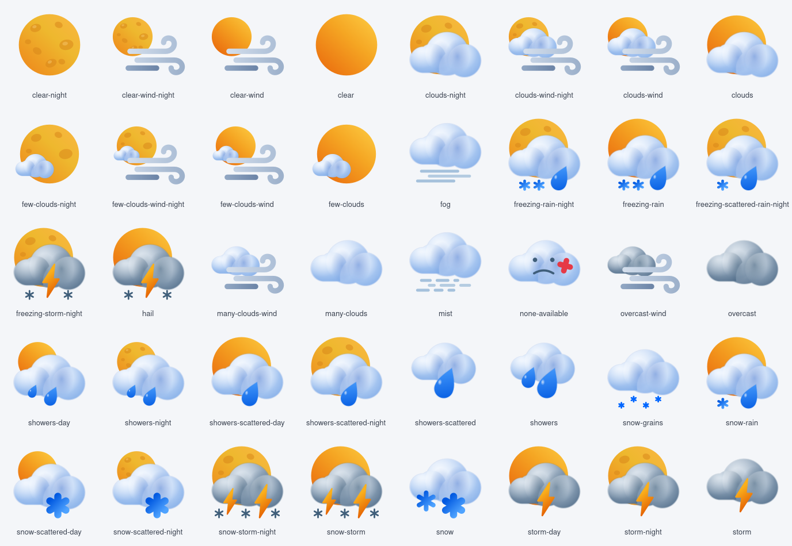

# Fenestra Weather

Colourful weather icons for KDE Plasma, part of the **Fenestra** series.



61 icons covering every weather state used by Plasma and its weather widgets:
clear sky, clouds, rain, showers, snow, sleet, freezing rain, hail, thunderstorms,
fog, mist and wind, each with a day (sun) and night (moon) version where it applies.

All icons are original drawings, created from scratch for Fenestra.

## Installation

### Option 1 – As an icon theme (simplest)

Install **Fenestra Weather** from the KDE Store (*System Settings → Colours & Themes → Icons → Get New…*),
or copy the `Fenestra-Weather` folder into:

```
~/.local/share/icons/
```

Then select **Fenestra Weather** in *System Settings → Colours & Themes → Icons*.

> Plasma uses only one icon theme at a time. With this option you get the Fenestra weather
> icons, and **Breeze** for every other icon. If you prefer to keep your current icon theme,
> use option 2.

### Option 2 – Add the weather icons to your own icon theme

Copy the files from `Fenestra-Weather/scalable/status/` into the `status` (or `scalable/status`)
folder of the icon theme you use, preferably a copy of it in `~/.local/share/icons/`.
Your theme stays the same, with the Fenestra weather icons on top.

## Contents

| Folder | Purpose |
|---|---|
| `Fenestra-Weather/` | The installable icon theme (`index.theme` + `scalable/status/`). |
| `source/` | The original drawings under their working names, for anyone who wants to edit or reuse them. |

## Credits

- Icons: © 2026 naykkalak – Fenestra series.

## License

The icons are licensed under the **GNU Lesser General Public License v3.0 or later**
(LGPL-3.0-or-later). See [`COPYING.LESSER`](COPYING.LESSER), which supplements the
GNU General Public License v3.0 in [`COPYING`](COPYING).

You may use, modify and share these icons, including in other themes or commercial
products, as long as modified versions of the icons remain under the same license and
the original author is credited.
